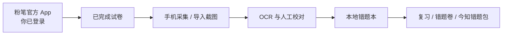

# 📒 丁真笔记本 · Fenbi Wrong-answer Notebook

### v1.3.4 · 本地优先的粉笔错题本

**收题 · 校对 · 错题 · 复习 · 组卷 · 今知错题包**


[v1.3.4 一键包](https://github.com/h1neolzr7f/dingzhen-notebook/releases/tag/v1.3.4) ·
[使用说明](docs/user-guide.md) ·
[更新记录](CHANGELOG.md) ·
[负责任使用](RESPONSIBLE_USE.md) ·
[参与贡献](CONTRIBUTING.md) ·
[路线图](ROADMAP.md)

> [!TIP]
> **不想一题一题截图整理？** 丁真笔记本把你已经完成的粉笔试卷，按“整卷采集 → OCR → 人工校对 → 错题复习 → 重新组卷”整理到本地；它不接管粉笔登录，也不允许 AI 覆盖官方答案和解析。

## 先看结果

| 你的痛点 | 这里怎么处理 |
|---|---|
| 一整套试卷截图太慢 | Android 采集端辅助翻页，桌面端批量接收 |
| OCR 可能把选项识别错 | 官方答案、用户答案、解析缺一项就进入“待校对” |
| 错题整理完就吃灰 | 预习、一刷、二刷、间隔复习与已掌握轨道 |
| 想把错题重新打印 | 按试卷、分类和知识点筛选并导出错题卷 |
| 担心账号与题库数据 | 不索要粉笔密码、Cookie 或 Token，数据默认只在本机 |

<p align="center">
  <strong><a href="https://github.com/h1neolzr7f/dingzhen-notebook/releases/tag/v1.3.4">下载 v1.3.4：Windows 一键包 + Android APK</a></strong>
</p>

> [!IMPORTANT]
> **非官方项目。** 本软件不登录粉笔，也不要账号、密码、Cookie 或 Token。请先用粉笔官方 App 登录，打开你已经完成、且有权查看的试卷，再用来收题。本项目与粉笔、猿辅导、今知错题本不存在隶属、授权或合作关系。维护者不为绕过访问控制、干扰平台运行、未经授权的数据采集或传播受保护内容提供支持。详见 [免责声明](DISCLAIMER.md) 与 [负责任使用说明](RESPONSIBLE_USE.md)。

> [!NOTE]
> **Windows 小白请下 Releases，不要直接翻源码。** 从 [v1.3.4](https://github.com/h1neolzr7f/dingzhen-notebook/releases/tag/v1.3.4) 下载 `DingzhenNotebook-OneClick-v1.3.4.zip`，解压后先看 `先看这个.txt`，再双击 `一键开始.bat`。手机安装包里的 `dingzhen-notebook-1.3.4.apk`。请用发布说明中的 SHA-256 核对压缩包。

## 它是做什么的

粉笔官方 App 负责登录和做题。丁真笔记本只负责把**已经完成的试卷**整理成本地错题本：题干、你的答案、正确答案、解析、复习轨道、错题卷。

数据只在这台电脑或这台手机上。缺官方答案或解析时，题目只能标成「待校对」，AI 不能瞎填。



## 小白三步

1. 安装 [Python 3.12 x64](https://www.python.org/downloads/release/python-31210/)（勾选 Add python.exe to PATH）。
2. 从 [Releases](https://github.com/h1neolzr7f/dingzhen-notebook/releases/tag/v1.3.4) 下载一键包并解压，双击 `一键开始.bat`。第一次会自动建环境，稍等即可。
3. 安装 `dingzhen-notebook-1.3.4.apk`。在已经登录的粉笔里打开已完成试卷，再回本软件点「开始采集」。

找不到自动翻页时：点「点我进入开关页」，打开「丁真自动翻页」，按返回。小米请滑到无障碍最底下的「已下载的服务」。实在不想找，选「我自己翻」。

## 核心能力

| 能力 | 说明 |
|---|---|
| **不登录粉笔** | 没有账号、密码、验证码、Cookie、Token 输入框 |
| **只打开粉笔** | 允许名单只有粉笔官方客户端，不打开猿题库 / 小猿搜题 |
| **完整错题本** | 手机底部五页：首页、收题、错题、复习、我的 |
| **待校对闸门** | 缺用户答案、官方答案、官方解析或证据 → `needs_review` |
| **AI 不覆盖官方字段** | 模型不能把官方答案或解析改成自己的猜测 |
| **今知错题包** | 本机导入 / 导出兼容格式，复习轨道与桌面一致 |
| **本地优先** | 错题、截图、SQLite 默认只在本机；发行包不含你的数据 |
| **最小权限** | 不申请通知，不扫描全部已装应用 |

## 手机端

桌面图标是 **丁真笔记本**。底部五页就是全部功能：

| 页 | 做什么 |
|---|---|
| 首页 | 错题 / 待复习 / 已掌握，今日复习，薄弱知识点 |
| 收题 | 在已经登录的粉笔里采集，不打开猿题库 |
| 错题 | 搜索、按试卷 / 分类 / 知识点筛选，校对 |
| 复习 | 预习 / 一刷 / 二刷 / 间隔 / 已掌握 |
| 我的 | 导入导出今知错题包、错题卷 HTML |

题干自动识别在电脑完成：采完用配对码传到电脑，识别后再把试卷 JSON 或错题包导回手机。手机上也可以自己校对。手机**不跑** PaddleOCR。

## 电脑端

| 入口 | 说明 |
|---|---|
| `一键开始.bat` | 推荐。Mock OCR，不下载模型，先把流程跑通 |
| `start_windows.bat` | 真实 PaddleOCR，首次会下载模型 |
| `start_cli_demo.bat` | 命令行演示导入闭环 |

```powershell
git clone https://github.com/h1neolzr7f/dingzhen-notebook.git
cd dingzhen-notebook
.\一键开始.bat
```

开发安装：

```powershell
py -3.12 -m venv .venv
.\.venv\Scripts\python.exe -m pip install -e ".[dev]"
.\.venv\Scripts\python.exe -m pytest -q -p no:cacheprovider
.\.venv\Scripts\python.exe -m apps.desktop.main --ocr-engine mock
```

## 硬规则

- 不登录粉笔，不保存密码 / Cookie / Token
- 只打开粉笔官方客户端（`com.fenbi.android.servant` 等），不打开猿题库、小猿搜题
- 缺用户答案、官方答案、官方解析或证据 → `needs_review`
- AI 不能覆盖官方字段
- 非必要权限不申请：不申请通知，不扫描全部已装应用

## 仓库结构

```text
apps/desktop/          Windows 桌面
apps/android-capture/  丁真笔记本 Android
packages/              OCR、采集、错题包、复习、组卷
samples/golden/        合成回归数据，没有真实试卷
scripts/               构建与一键打包
tests/                 pytest
```

## 隐私与安全

- 错题、截图、数据库默认只在本机 `data/`、`exports/`
- 发行包和 git 不含你的错题
- 局域网传图需要同一 Wi-Fi 和配对码，密钥用完即弃
- 本地 HTTP AI 适配器默认只允许回环地址
- Android 随附 APK 使用 debug 证书，仅适合本人侧载，不要上架应用商店

安全问题请不要在公开 Issue 中粘贴账号、Cookie、真实试卷或配对密钥，参见 [SECURITY.md](SECURITY.md)。

## 测试

```powershell
.\.venv\Scripts\python.exe -m pytest -q -p no:cacheprovider
```

Android 工程：

```powershell
cd apps\android-capture
.\gradlew.bat testDebugUnitTest
```

不要把真实试卷截图放进 `samples/` 或测试夹具。

## 贡献

欢迎提交小白说明、Windows 一键启动、小米权限引导、只打开粉笔的防护、校对 / 复习 / 错题包，以及测试。开始前请阅读 [CONTRIBUTING.md](CONTRIBUTING.md)。

不要在 Issue、PR 或截图里提交真实试卷、账号或本机数据库。不接受登录粉笔或把无障碍扩到任意 App 的改动。

## 路线图

当前维护线是 **v1.3.4**。已完成项与下一步见 [ROADMAP.md](ROADMAP.md)，版本记录见 [CHANGELOG.md](CHANGELOG.md)。

## 许可

代码为 [MIT License](LICENSE)。代码许可不授予粉笔、猿辅导、今知或任何试卷内容的权利。

本项目按现状提供。完整边界见 [DISCLAIMER.md](DISCLAIMER.md) 与 [RESPONSIBLE_USE.md](RESPONSIBLE_USE.md)。

---

**丁真笔记本 v1.3.4** · 一键包与源码请从 [本仓库 Releases](https://github.com/h1neolzr7f/dingzhen-notebook/releases/tag/v1.3.4) 下载，并用 SHA-256 核对：

```
DingzhenNotebook-OneClick-v1.3.4.zip
SHA-256 d5a25fb6846b833dcf9dc6980dd7dcf9dd467444d079c3a330110ab716108368
```

Dingzhen Notebook is a local-first personal workbook for papers you already finished in the official Fenbi app. It never logs into Fenbi. Not affiliated with Fenbi, Yuanfudao, or Jinzhi.
